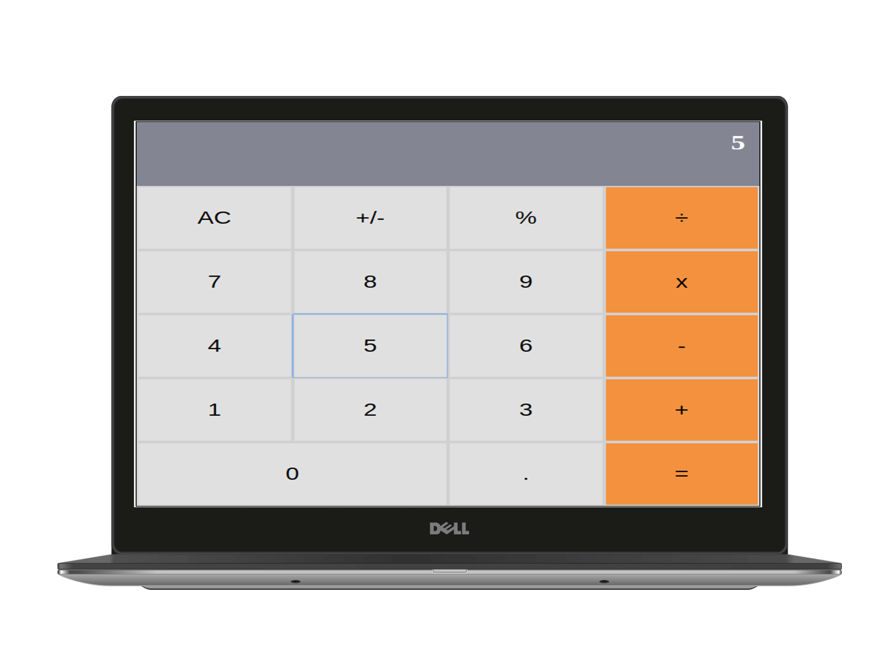

# 💻 Math Calculator (BETA)



Math calculator is a web app that enables the user to perform a set of basic Mathematical operations on Numbers and to evaluate Basic expressions. In this app we used the following technologies:

HTML | CSS(SASS) | Javascript | React
------------ | ------------- | ----------- | -----------
 |  |  | 


* This design of this project is an assignment that falls under microverse's React & Redux curriculium:
  - [link to the assignment](https://microverse.pathwright.com/library/fast-track-curriculum/69047/path/step/44896082/)


## ✨ Live Demo

You can look at it [here](https://gifted-bose-6eb952.netlify.com/)

## 🚀 Getting Started

To get a local copy up and running follow these simple example steps.

### Clone

```sh
git git@github.com:stratospherique/Calculator-React.git
cd calculator-react
```

### Install

```sh
npm install
```

### Usage

```sh
npm start
```

## :pencil2: Todo
- Tests to be added

## Author

:male_detective: Ahmed Mahfoudh

- [Github](https://github.com/stratospherique)
- [Linkedin](https://www.linkedin.com/in/ahmed-mahfoudh/)
- [Twitter](https://twitter.com/AhmedMahfoudh8)
- [Email](mailto:ahmed.mahfoudh1991@gmail.com?subject=Website%20Inquiry)

## 🤝 Contributing

Contributions, issues and feature requests are welcome!

Feel free to check the [issues page](issues/).

## Show your support

Give a ⭐️ if you like this project!

> “There is no exercise better for the heart than reaching down and lifting people up.” John Holmes